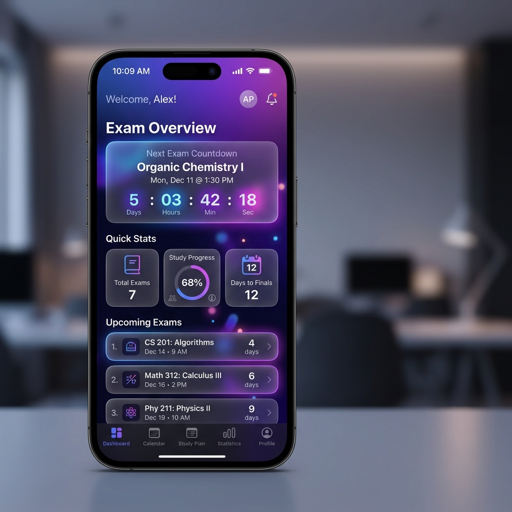
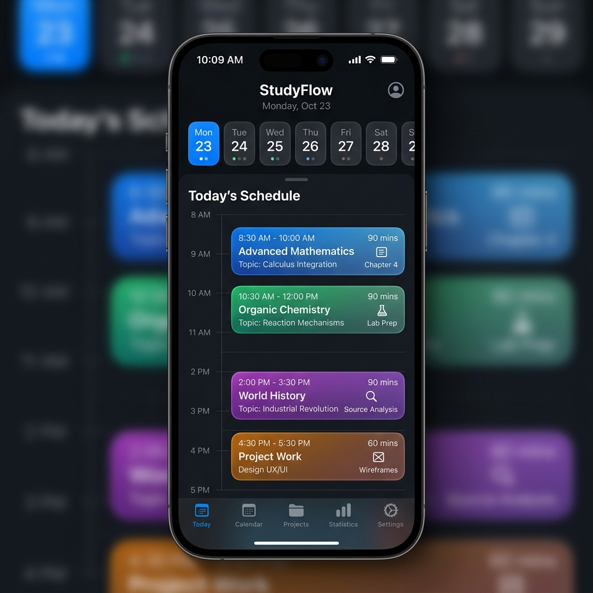
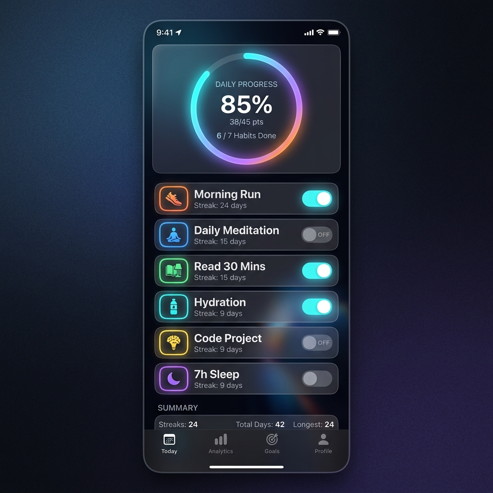

# 🎓 SRM Exam Planner

A stunning, premium iOS app built with **SwiftUI** to help SRM University students plan and track their exam preparation.

<div align="center">
  
  
  
</div>

## ✨ Features

### 📱 5-Tab Navigation
- **Home** — Dashboard with live exam countdown, quick stats, upcoming exams
- **Subjects** — Track progress across all 6 subjects with animated progress bars
- **Planner** — Daily study schedule with timeline view and weekly calendar strip
- **Habits** — Daily habit tracker with animated circular progress ring
- **Profile** — Settings, academic info, and app preferences

### 🎨 Design Highlights
- **Dark glassmorphism** UI with ultra-thin material blur
- **Custom floating tab bar** with animated selection indicator
- **Live countdown timer** to exam day (May 24, 2026)
- **Animated progress bars** and **circular progress rings**
- **Spring animations** on all card entrances
- **Adaptive layout** for all iPhone sizes (SE to Pro Max)

### 💾 Persistence
- Habit completion states persist via **UserDefaults**
- Daily auto-reset of habits at midnight

## 🛠 Tech Stack

| Technology | Purpose |
|---|---|
| SwiftUI | UI Framework |
| Combine | Reactive state management |
| UserDefaults | Local persistence |
| SF Symbols | Iconography |
| @EnvironmentObject | Shared state |

## 📂 Project Structure

```
SRMExamPlanner/
├── SRMExamPlannerApp.swift          # App entry point
├── Theme/
│   └── AppTheme.swift               # Design system (colors, gradients, spacing)
├── Models/
│   ├── Exam.swift                   # Exam data model
│   ├── Subject.swift                # Subject data model
│   └── Habit.swift                  # Habit data model (Codable)
├── Utilities/
│   ├── DateHelper.swift             # Date calculations & countdown
│   └── HabitStore.swift             # ObservableObject persistence layer
├── Components/
│   ├── GlassCard.swift              # Reusable glassmorphic card
│   ├── CircularProgressRing.swift   # Animated circular progress
│   ├── AnimatedProgressBar.swift    # Animated linear progress
│   ├── ExamCountdownCard.swift      # Live countdown component
│   ├── ExamCard.swift               # Individual exam card
│   └── CustomTabBar.swift           # Floating tab bar with blur
└── Views/
    ├── MainTabView.swift            # Tab container
    ├── Home/
    │   ├── HomeView.swift           # Home dashboard
    │   └── ProfileSheetView.swift   # Profile bottom sheet
    ├── Subjects/
    │   └── SubjectsView.swift       # Subject progress list
    ├── Planner/
    │   └── PlannerView.swift        # Study planner + timeline
    ├── Habits/
    │   └── HabitsView.swift         # Daily habit tracker
    └── Profile/
        └── ProfileView.swift        # Settings & profile
```

## 🚀 Getting Started

### Prerequisites
- **Xcode 15+** (macOS Sonoma or later recommended)
- **iOS 16+** deployment target

### Setup
1. Clone the repository
2. Open Xcode → **File → New → Project → iOS → App**
3. Set Product Name to `SRMExamPlanner`
4. Select **SwiftUI** for Interface, **Swift** for Language
5. Replace the generated files with the source files from this repo
6. Build and run on simulator or device (⌘+R)

## 📋 Requirements
- iOS 16.0+
- Xcode 15.0+
- Swift 5.9+

## 📄 License
This project is licensed under the [MIT License](LICENSE).
