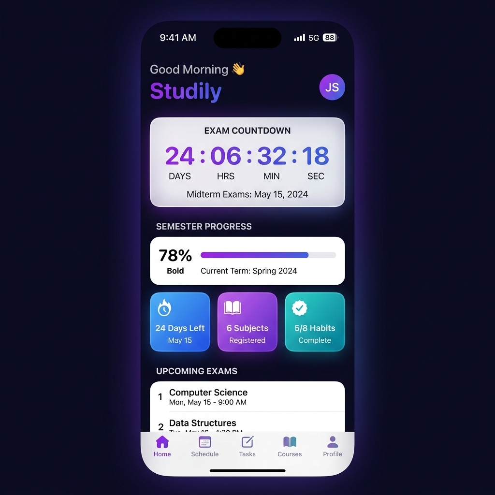
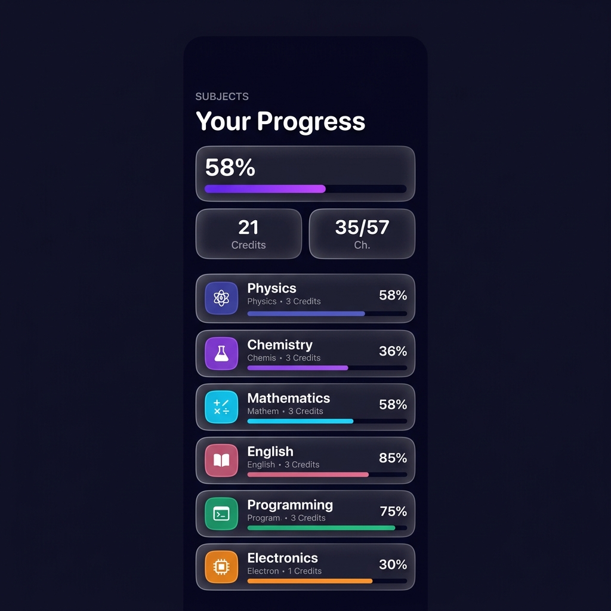
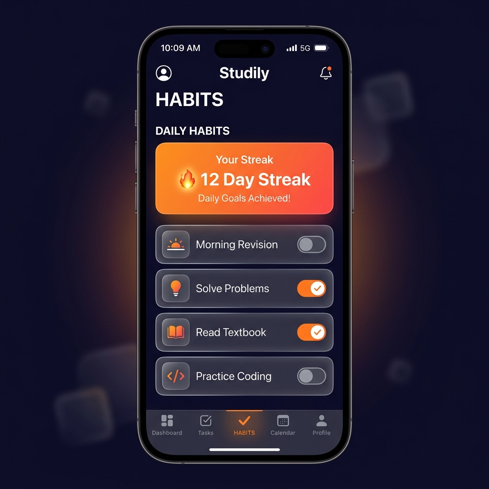

# ✦ Studily

A stunning, premium iOS app built with **SwiftUI** to help SRM University students plan and track their exam preparation.

<p>
  
  
  
</p>

---

## ✨ Features

| Tab | Description |
|---|---|
| **Home** | Live exam countdown timer, daily habit progress bar, upcoming exam cards |
| **Subjects** | Editable subject list with progress bars, add/delete subjects, chapter tracking |
| **Planner** | Weekly exam schedule with color-coded subject blocks |
| **Habits** | Daily study habit checklist with streak tracking and animated toggles |
| **Profile** | Set custom exam date via DatePicker, toggle daily 7PM study reminder, view stats |

## 🏗️ Tech Stack

| | |
|---|---|
| **Framework** | SwiftUI (100% native) |
| **State** | Combine + `@ObservableObject` |
| **Persistence** | UserDefaults (JSON encoded) |
| **Icons** | SF Symbols |
| **Notifications** | UNUserNotificationCenter |
| **Min Target** | iOS 16.0 |
| **Dependencies** | Zero — no third-party packages |

## 📂 Project Structure

```
Studily/
├── StudilyApp.swift              ← Entry point + notification setup
├── Store/
│   └── HabitStore.swift          ← Central ObservableObject store
├── Models/
│   ├── Habit.swift               ← Daily study habits
│   ├── Subject.swift             ← Codable, editable subjects
│   └── Exam.swift                ← Exam schedule data
├── Components/
│   ├── CustomTabBar.swift        ← Floating glassmorphism tab bar
│   ├── ExamCountdownCard.swift   ← Dynamic countdown (reads from store)
│   ├── ExamCard.swift            ← Individual exam row
│   ├── GlassCard.swift           ← Reusable glass container
│   ├── CircularProgressRing.swift
│   └── AnimatedProgressBar.swift
├── Theme/
│   └── AppTheme.swift            ← Colors, gradients, spacing
├── Utilities/
│   ├── DateHelper.swift          ← Dynamic date calculations
│   └── NotificationHelper.swift  ← Push notification scheduling
└── Views/
    ├── MainTabView.swift
    ├── Home/
    ├── Subjects/
    ├── Planner/
    ├── Habits/
    └── Profile/
```

## 🚀 Getting Started

### Prerequisites
- Xcode 15+ (macOS Sonoma or later)
- iOS 16.0+ device or simulator

### Run It

```bash
git clone https://github.com/ganesh-io/Studily.git
open Studily.xcodeproj
```

Press `Cmd + R` to build and run.

## 📋 Requirements

| | |
|---|---|
| iOS | 16.0+ |
| Xcode | 15+ |
| Swift | 5.9+ |

## 📄 License

This project is licensed under the MIT License — see the [LICENSE](LICENSE) file for details.

---

<div align="center">
<sub>Made for SRM Students</sub>
</div>
